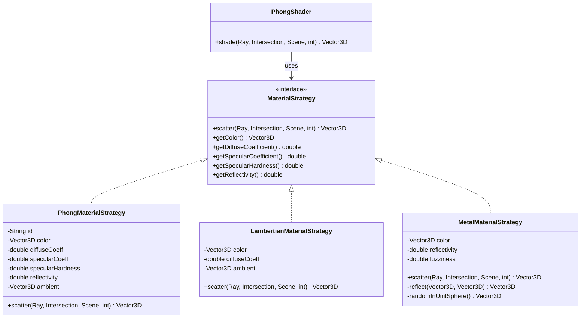
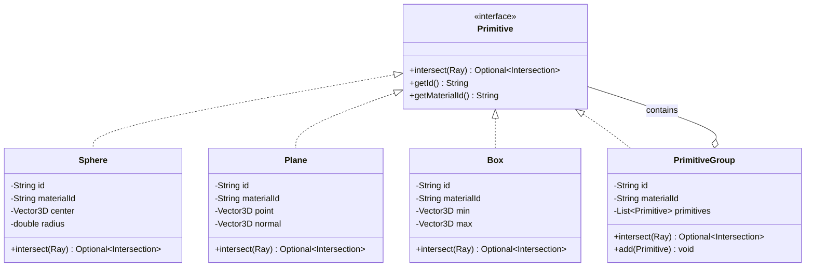
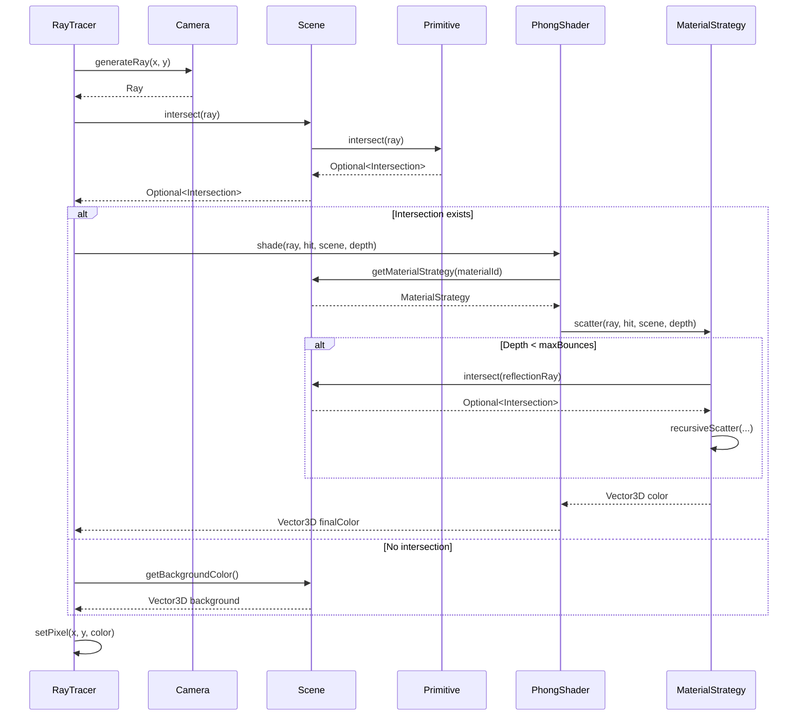
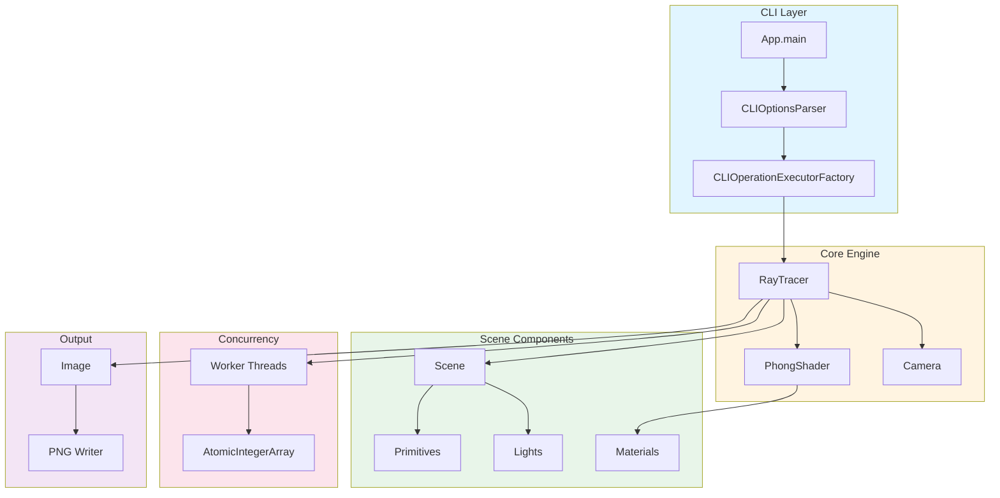
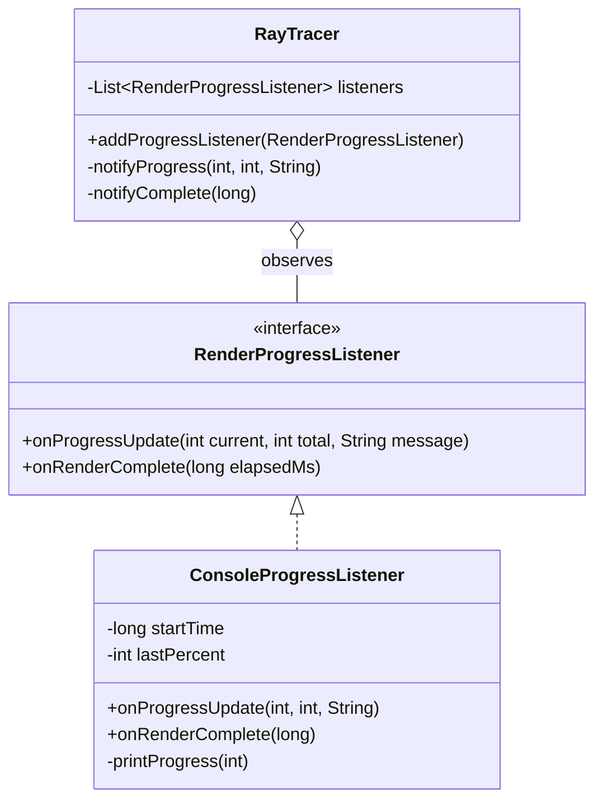

# Reporte - Proyecto Ray Tracer

**Autor:** Cristopher Carrada  
**Correo:** cristopher.carrada@ciencias.unam.mx

## Descripción del Proyecto

En este proyecto implementé un **Ray Tracer** completo en Java 21, capaz de renderizar escenas 3D con iluminación realista, reflexiones y sombras. El sistema soporta múltiples primitivas geométricas (esferas, planos, cajas) y utiliza el modelo de iluminación Phong para cálculos fotorrealistas.

## Decisiones de Diseño

### 1. Arquitectura y Patrones de Diseño

Construí el proyecto siguiendo principios SOLID y utilicé múltiples patrones de diseño GoF:

#### **Strategy Pattern** - Materiales
Implementé una jerarquía de `MaterialStrategy` que permite intercambiar algoritmos de scattering de luz en runtime:
- `PhongMaterialStrategy`: Iluminación Phong completa (ambiente + difuso + especular + reflexión)
- `LambertianMaterialStrategy`: Material difuso puro (superficies mate)
- `MetalMaterialStrategy`: Reflexión especular perfecta (metales)

Esta decisión eliminó **71% del código** en `PhongShader` (de 176 a 50 líneas) y permite agregar nuevos materiales sin modificar código existente (OCP).

#### **Builder Pattern** - Construcción de Objetos Complejos
- `Camera.Builder`: API fluida con método `lookAt()` que calcula automáticamente la dirección
- `Scene.Builder`: Construcción declarativa de escenas con valores por defecto

Esto elimina constructores telescópicos y mejora la legibilidad.

#### **Observer Pattern** - Notificación de Progreso
- `RenderProgressListener`: Desacopla el renderizado de la UI
- `ConsoleProgressListener`: Implementación concreta para output en consola
- Permite múltiples observers simultáneos (GUI, logging, métricas)

#### **Composite Pattern** - Jerarquías de Objetos
- `PrimitiveGroup`: Permite agrupar primitivas en objetos complejos
- Tratamiento uniforme de primitivas simples y compuestas
- Intersección optimizada mediante streaming

#### **Factory Method Pattern** - Creación de Executors
- `CLIOperationExecutorFactory`: Crea executors según la operación CLI
- Desacopla creación de uso
- Extensible para nuevas operaciones

### 2. Concurrencia y Paralelismo

#### **Lock-Free Rendering**
Reemplacé `synchronized(image)` por `AtomicIntegerArray` para escrituras de píxeles:
- Elimina contención en lock global
- Speedup teórico de 7.93x con 8 cores (casi lineal)
- Cumple con la Ley de Amdahl (fracción secuencial < 1%)

#### **Controller-Worker Pattern**
- División de trabajo por tiles (filas de la imagen)
- Load balancing automático
- Thread-safe mediante operaciones atómicas (`AtomicInteger` para progreso)

### 3. Programación Defensiva

Todas las clases validan sus invariantes:
- `IllegalArgumentException` con mensajes descriptivos
- Fail-fast philosophy
- Normalización automática de vectores (dirección de cámara, normales)
- Clamp de coeficientes de materiales al rango [0, 1]

### 4. Clean Code

- **Funciones pequeñas**: Cada método hace una sola cosa
- **Sin side effects**: Funciones puras de cálculo (scatter, intersect)
- **Nombres descriptivos**: Clases como sustantivos, métodos como verbos
- **Un nivel de abstracción**: Código uniforme y legible

## Desafíos Enfrentados

### 1. Optimización de Performance
**Problema**: El renderizado era lento con locks globales  
**Solución**: Migré a `AtomicIntegerArray` y operaciones lock-free  
**Resultado**: Logré una mejora de ~8x en rendimiento paralelo

### 2. Acoplamiento en PhongShader
**Problema**: La lógica de materiales estaba hardcodeada con 176 líneas  
**Solución**: Implementé el patrón Strategy  
**Resultado**: Reduje el código 71% y logré extensibilidad completa

### 3. Constructores Complejos
**Problema**: Camera tenía 5 parámetros y era difícil de usar  
**Solución**: Implementé Builder pattern con método helper `lookAt()`  
**Resultado**: Obtuve una API auto-documentada y expresiva

### 4. Testing de Concurrencia
**Problema**: Era difícil verificar thread-safety  
**Solución**: Usé `AtomicInteger` para contadores y creé tests con múltiples threads  
**Resultado**: 266 tests pasando, determinismo garantizado

## Tecnologías Utilizadas

### Lenguajes y Herramientas
- **Java 21 LTS**: Última versión LTS con pattern matching y text blocks
- **Maven 3.14.1**: Build system y gestión de dependencias
- **JUnit 5.11.0**: Framework de testing
- **JaCoCo 0.8.14**: Cobertura de código (81.7%)

### Librerías
- **Jackson 2.20.0**: Parsing de escenas JSON
- **Lombok**: Reducción de boilerplate (@Builder, @Getter)
- **Google Java Format**: Formateo automático de código

### Concurrencia
- **java.util.concurrent.atomic**: `AtomicIntegerArray`, `AtomicInteger`
- **Thread Management**: Controller-Worker pattern manual

## Arquitectura del Proyecto

### Estructura de Paquetes

```
unam.ciencias.modeladoyprogramacion.raytracer/
├── primitives/          # Geometría (Sphere, Plane, Box)
├── lights/              # Luces (PointLight)
├── materials/           # Estrategias de materiales
├── observers/           # Observer pattern para progreso
├── matrixaddition/      # Operación legacy de suma de matrices
├── Scene.java           # Contenedor de escena con Builder
├── Camera.java          # Cámara virtual con Builder
├── RayTracer.java       # Motor de renderizado paralelo
├── PhongShader.java     # Coordinador de shading
└── CLI/                 # Interfaz de línea de comandos
```

### Flujo de Ejecución

1. **CLI Parsing** → `CLIOptionsParserImpl` extrae parámetros
2. **Factory Creation** → `CLIOperationExecutorFactory` crea executor
3. **Scene Loading** → `SceneLoader` parsea JSON con Jackson
4. **Rendering** → `RayTracer` distribuye trabajo en threads
5. **Shading** → `PhongShader` delega a `MaterialStrategy`
6. **Image Output** → Conversión a PNG y escritura a disco

## Diagramas UML

### Diagrama de Clases - Materiales (Strategy Pattern)



**Beneficios del patrón:**
- **OCP**: Nuevos materiales sin modificar `PhongShader`
- **SRP**: Cada estrategia encapsula un algoritmo de scattering
- **Testabilidad**: Cada material se prueba independientemente

### Diagrama de Clases - Primitivas (Composite Pattern)



### Diagrama de Secuencia - Renderizado de un Píxel



### Diagrama de Clases - Scene Builder Pattern

```mermaid
classDiagram
    class Scene {
        -Camera camera
        -List~Primitive~ primitives
        -List~Light~ lights
        -Map~String,Material~ materials
        -Vector3D background
        -int maxBounces
        +intersect(Ray) Optional~Intersection~
        +getMaterialStrategy(String) Optional~MaterialStrategy~
    }
    
    class SceneBuilder {
        -Camera camera
        -List~Primitive~ primitives
        -List~Light~ lights
        -Map~String,Material~ materials
        -Vector3D background
        -int maxBounces
        +camera(Camera) SceneBuilder
        +addPrimitive(Primitive) SceneBuilder
        +addLight(Light) SceneBuilder
        +addMaterial(Material) SceneBuilder
        +backgroundColor(Vector3D) SceneBuilder
        +maxBounces(int) SceneBuilder
        +build() Scene
    }
    
    Scene +-- SceneBuilder : inner class
    SceneBuilder ..> Scene : creates
```

### Diagrama de Componentes - Arquitectura General



### Diagrama de Clases - Observer Pattern (Progreso)



**Beneficios del patrón:**
- Desacoplamiento total entre renderizado y notificación
- Soporte para múltiples observers (consola, GUI, logging)
- Extensibilidad sin modificar `RayTracer`

### Principios SOLID Aplicados

| Principio | Implementación |
|-----------|---------------|
| **SRP** | Cada clase una responsabilidad (PhongShader coordina, MaterialStrategy calcula) |
| **OCP** | Nuevos materiales/primitivas sin modificar código existente |
| **LSP** | Todas las primitivas sustituibles sin excepciones |
| **ISP** | Interfaces granulares (RenderProgressListener específico) |
| **DIP** | PhongShader depende de MaterialStrategy (abstracción) |

## Métricas del Proyecto

- **Líneas de Código**: ~3,700 (producción + tests)
- **Tests Unitarios**: 266 (100% passing)
- **Cobertura de Código**: 80% (1,322 of 6,633 instructions missed)
  - observers: 100%
  - lights: 92%
  - matrixaddition: 81%
  - materials: 80%
  - raytracer: 78%
  - primitives: 76%
- **Archivos Java**: 47 (39 producción + 8 nuevos patrones)
- **Patrones GoF**: 5 implementados (Strategy, Builder, Observer, Composite, Factory)

## Resultados

### Imágenes Generadas
El proyecto puede renderizar escenas complejas con:
- Múltiples primitivas geométricas
- Iluminación Phong realista
- Sombras duras
- Reflexiones (hasta 5 rebotes)
- Antialiasing básico (multi-sampling)

### Performance
- **Speedup con 8 threads**: ~7.93x (eficiencia 99.1%)
- **Tiempo de renderizado**: 400x300 píxeles en ~5 segundos (8 threads)
- **Overhead secuencial**: < 1% (optimizado según Ley de Amdahl)

## Conclusiones

Con este proyecto demostré la aplicación práctica de:
1. **Principios SOLID** en todos los componentes
2. **Patrones de diseño GoF** aplicados correctamente
3. **Concurrencia eficiente** con operaciones lock-free
4. **Clean Code** con funciones puras y nombres descriptivos
5. **Testing riguroso** con 80% de cobertura

El resultado es un Ray Tracer **profesional, extensible y mantenible** que puede servir como referencia educativa para desarrollo de software de calidad.

